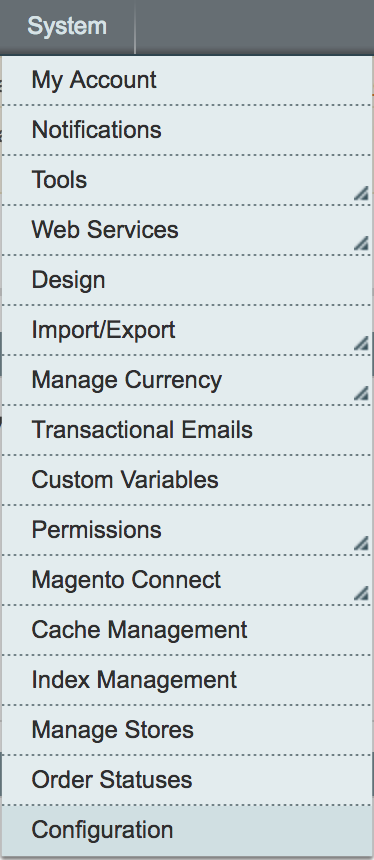
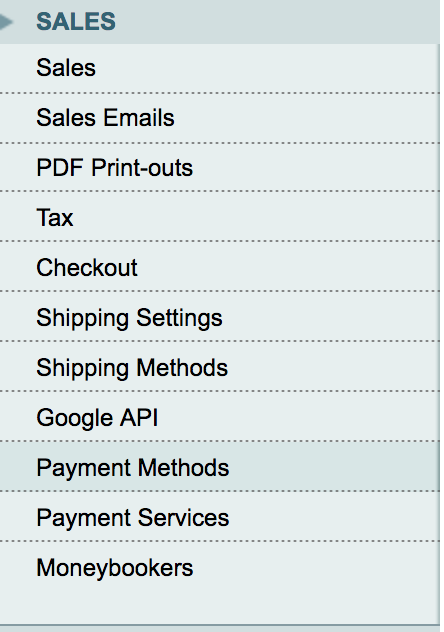
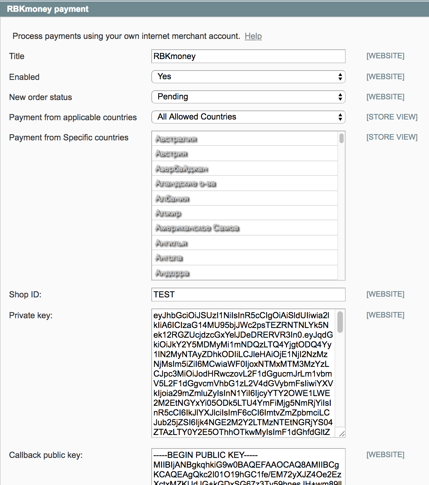

# rbkmoney-cms-magento

Пожалуйста, обязательно делайте бекапы!

Платежный плагин RBKmoney для **Magento**

Модуль разрабатывался и тестировался на **Magento 1.9.1.0**


#### Требования

- PHP 5.4 (минимум)
- OpenSSL - 1.0.2k-fips (минимум)
- Curl


### Установка и настройка модуля

- Скопировать содержимое `app` в соответствующую папку `app/`

- Установленный модуль заработает сразу после его настройки в админке:
```
"Система - Конфигурация" (System - Configuration)"
```


```
"Продажи - Методы оплаты" (Sales - Payment Methods)
```



#### Для начала приема платежей на Вашем сайте осталось совсем немного




Настройте плагин в соответствии с данными из [личного кабинета RBKmoney](https://dashboard.rbk.money).

`Shop ID` - идентификатор магазина из RBKmoney. Скопируйте его в Личном кабинете RBKmoney в разделе Детали магазина, поле Идентификатор;

`Private key` - ключ для доступа к API. Скопируйте его в Личном кабинете RBKmoney в разделе API Ключ

`Callback public key` - ключ для обработки уведомлений о смене статуса

- Заходим в личный кабинет RBKmoney: Создать Webhook;
- Вставляем в поле URL вида `http{s}://{your-site}/rbkmoney/payment/notification`, скопированного из `Notification URL`
- Выбираем Типы событий `InvoicePaid` и `Invoice Canсelled`;
- после создания Webhook-а копируем Публичный ключ после нажатия Показать детали;
- скопированный ключ вставляем в поле `Публичный ключ` на странице настроек модуля;


- Сохраните изменения и проведите тестовый платеж


В настройках модуля можно включить или отключить логирование `Debug on/off`
С результатом логирования можно ознакомиться по пути `/var/log/rbkmoney.log` в корне сайта


### Нашли ошибку или у вас есть предложение по улучшению модуля?

Пишите нам `support@rbkmoney.com` При обращении необходимо:

- Указать наименование CMS и компонента магазина, а также их версии
- Указать версию платежного модуля (доступна на странице Управление пакетами)
- Описать проблему или предложение
- Приложить снимок экрана (для большей информативности)
